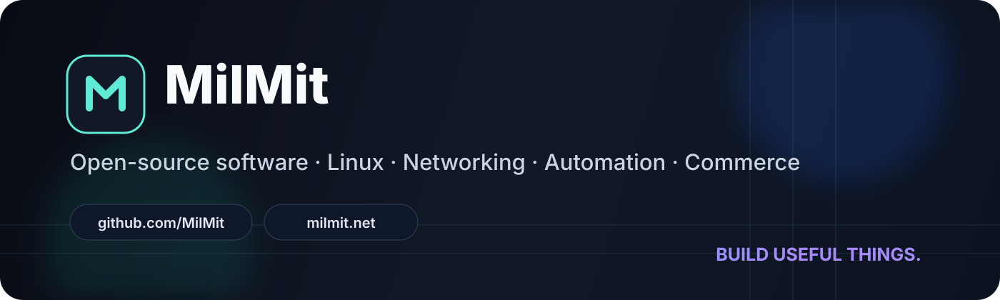

 

**English** · [فارسی](#فارسی)

---

## Who we are

**MilMit** is an independent software and digital-product organization founded by [Milad Dadgar](https://github.com/miladdadgar).

We build practical tools across **Linux, networking, automation, desktop and mobile apps, WordPress, WooCommerce and API integrations**.

> **Useful software. Clear engineering. No inflated claims.**

## Featured projects

<table>
<tr>
<td width="50%" valign="top">

### 🩺 [LinuxCare](https://github.com/MilMit/LinuxCare-App)
Native Linux maintenance and diagnostics built with **Rust, GTK4 and Libadwaita**.

</td>
<td width="50%" valign="top">

### 💬 [ChatDesk Linux](https://github.com/MilMit/chatdesk-linux)
A Linux desktop workspace for ChatGPT with isolated profiles, quick capture, workspaces and privacy-focused workflows.

</td>
</tr>
<tr>
<td width="50%" valign="top">

### 🌐 [ModemDeck](https://github.com/MilMit/modemdeck-linux)
Desktop tooling for modem and network management with a clean, practical Linux-first experience.

</td>
<td width="50%" valign="top">

### 🔐 [IKEv2 Linux for Surfshark](https://github.com/MilMit/ikev2-linux-for-surfshark)
Ubuntu-focused IKEv2 tooling using **StrongSwan**, secure credential handling and real connection testing.

</td>
</tr>
<tr>
<td width="50%" valign="top">

### ⚡ [Mesora](https://github.com/MilMit/mesora-wordpress-live-chat)
WordPress live chat and Telegram-based pre-sale support integration.

</td>
<td width="50%" valign="top">

### 🛒 [TeleNexa](https://github.com/MilMit/telenexa-commerce-for-telegram)
Commerce tooling for connecting **WooCommerce and Telegram**.

</td>
</tr>
<tr>
<td width="50%" valign="top">

### 📡 [NordVPN WireGuard Extractor](https://github.com/MilMit/nordvpn-wireguard-extractor)
Extracts NordLynx/WireGuard configuration data and produces mobile-friendly QR codes.

</td>
<td width="50%" valign="top">

### 📱 [AdvanceGram](https://github.com/MilMit/AdvanceGram)
Telegram-focused Android experimentation and mobile application R&D.

</td>
</tr>
</table>

## Technology map

  

| Area | Focus |
| --- | --- |
| **Linux & Desktop** | Rust, GTK4, Libadwaita, Electron, Ubuntu, GNOME |
| **Mobile** | Android, Flutter, Dart, Java |
| **Networking** | VPN, IKEv2, WireGuard, diagnostics and connectivity |
| **WordPress & Commerce** | WordPress, WooCommerce, PHP, plugins and integrations |
| **Automation** | Telegram, APIs, bots and workflow automation |
| **Product Engineering** | UX, security, packaging, CI/CD and release engineering |

## GitHub activity

## Engineering principles

- Build features that solve real problems instead of inflating feature lists.
- Keep security boundaries and privileged operations explicit.
- Prefer reversible and inspectable system operations.
- Verify functionality instead of claiming behavior the software cannot prove.
- Treat documentation, privacy and release quality as part of the product.
- Keep open-source projects understandable enough to inspect and improve.

## Open source

Selected MilMit projects are public so developers can inspect the implementation, reproduce issues, contribute improvements and reuse ideas responsibly.

A useful bug report includes the environment, exact reproduction steps, expected behavior, actual behavior and relevant logs with secrets removed.

## Founder

MilMit was founded by **[Milad Dadgar](https://github.com/miladdadgar)**, a software developer with approximately 13 years of programming experience.

His work spans software engineering, Linux tooling, networking, web platforms and biomedical research.

**Research:** [Molecular Biology Reports — Springer](https://doi.org/10.1007/s11033-026-11566-8) · [PubMed](https://pubmed.ncbi.nlm.nih.gov/41774233/)

## فارسی

**MilMit | میل‌میت** یک مجموعه مستقل توسعه نرم‌افزار و محصولات دیجیتال است که توسط **[میلاد دادگر](https://github.com/miladdadgar)** تأسیس شده است.

تمرکز MilMit روی ساخت ابزارهای کاربردی و قابل اتکا در حوزه‌های **Linux، شبکه و VPN، اتوماسیون، اپلیکیشن‌های دسکتاپ و موبایل، WordPress، WooCommerce و یکپارچه‌سازی API** است.

بخشی از پروژه‌های MilMit به‌صورت متن‌باز منتشر می‌شوند تا توسعه‌دهندگان بتوانند کد را بررسی کنند، مشکلات را گزارش دهند و در توسعه پروژه‌ها مشارکت داشته باشند.

## Connect

**Website:** [milmit.net](https://milmit.net) · **GitHub:** [github.com/MilMit](https://github.com/MilMit) · **Founder:** [Milad Dadgar](https://github.com/miladdadgar)

---

### Build useful things. Keep the engineering honest.

MilMit · Software · Open technology · Digital products

